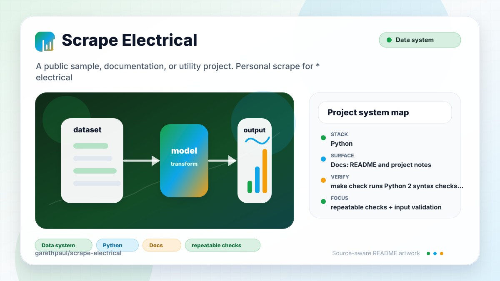

# scrape-electrical

<!-- README-OVERVIEW-IMAGE -->


## Overview

`garethpaul/scrape-electrical` is a public sample, documentation, or utility project. Personal scrape for * electrical with a given URL

This README is based on the checked-in source, manifests, scripts, and repository metadata on the `master` branch. The project language mix found during review was: Python (1).

## Repository Contents

- `README.md` - project overview and local usage notes
- `CHANGES.md` - maintenance history for scraper safety checks
- `Makefile` - local verification entry points
- `docs/plans` - completed maintenance plans for the current baseline
- `plans` - historical implementation notes
- `requirements.txt` - optional scraper/database dependencies
- `scripts` - documentation-plan validators
- `scrape.py` - scraper and PostgreSQL insert implementation
- `tests` - Python 2 parser and database unit tests
- `SECURITY.md` - security reporting and disclosure guidance
- `VISION.md` - project direction and maintenance guardrails

Additional scan context:

- Source directories: no top-level source directories detected
- Dependency and build manifests: requirements.txt
- Entry points or build surfaces: none detected
- Test-looking files: tests/test_scrape.py

## Getting Started

### Prerequisites

- Git
- Python 2.7
- PostgreSQL client access for live database writes

### Setup

```bash
git clone https://github.com/garethpaul/scrape-electrical.git
cd scrape-electrical
python2 -m pip install -r requirements.txt
```

The setup commands above are derived from repository files. Legacy mobile, Python, or JavaScript samples may require older SDKs or package versions than a modern workstation uses by default.

## Running or Using the Project

- Preview parsed rows without PostgreSQL writes:

```bash
python2 scrape.py --url https://example.test/products --dry-run
```

- For live writes, pass all database fields explicitly:

```bash
python2 scrape.py --url https://example.test/products \
  --db-name products_db \
  --db-user scraper \
  --db-password "$SCRAPE_DB_PASSWORD" \
  --db-host db.example.test \
  --table-name products
```

- Existing callers can still import `scrape.py`, create a `Database` instance,
  and pass it to `main(database, url)`.
- Confirm target-site permission and rate limits before scraping.
- Use test data first; the script writes to PostgreSQL when `Product.find()`
  inserts parsed products.
- Use `--dry-run` before live writes to confirm parser output.
- The default request path does not set fake browser, referer, or randomized
  tracking headers.
- Live fetches use a bounded default timeout so stalled requests do not hang
  forever.
- Live fetches also enforce a 5 MiB response body size limit before HTML
  parsing; override it with `--max-response-bytes` for a reviewed target.
- Source page URLs must use `http` or `https` and include a host before the
  scraper opens them.
- Product cards without usable links are skipped rather than aborting the
  scrape.
- Parsed product links are resolved against the source URL and must use
  `http` or `https` before they are inserted.
- Database connection fields are passed to `psycopg2` as structured keyword
  arguments instead of an interpolated connection string.

## Testing and Verification

- `make check` runs Python 2 syntax checks plus mocked database and parser
  unit tests.
- `make check` requires Python 2 and runs the documentation, workflow-policy,
  syntax, and all 25
  mocked database and parser tests without successful skip paths.
- GitHub Actions runs that full offline gate in a digest-pinned Python 2.7.18
  container with credential-free pinned checkout, read-only permissions, and
  no live scraper/database packages.
- Parser tests cover missing prices, missing titles, and missing or blank
  product links.
- Parser tests also cover non-web link rejection and relative product-link
  normalization.
- Parser tests also cover source page URL scheme validation and whitespace
  normalization.
- Network tests require HTTP responses to close after successful and failed
  body reads.
- Network tests cover the exact response body size limit, oversized rejection,
  configured read size, and response closure.
- Database tests cover parameterized inserts and structured `psycopg2`
  connection parameters without requiring a live PostgreSQL server.
- Database tests also cover cursor-first cleanup and connection close attempts
  when cursor cleanup fails.
- CLI tests cover dry-run parsing, dry-run output, complete credential
  requirements for live writes, and explicit live database construction.
- `make check` runs with Python bytecode disabled and fails if `.pyc` or `.pyo`
  files are present in the checkout.
- `make check` also requires completed canonical plans under `docs/plans`.

When the required SDK or runtime is unavailable, use static checks and source review first, then verify on a machine that has the matching platform toolchain.

## Configuration and Secrets

- Live PostgreSQL runs require operator-provided database connection fields.
  Keep credentials in the shell or a local secret manager; do not commit them.

## Security and Privacy Notes

- Review changes touching authentication or token handling; examples from the scan include scrape.py.
- Review changes touching network requests, sockets, or service endpoints; examples from the scan include scrape.py.
- Review changes touching database, model, or persistence code; examples from the scan include scrape.py.

## Maintenance Notes

- See `SECURITY.md` for vulnerability reporting and safe research guidance.
- See `VISION.md` for project direction and contribution guardrails.
- See `docs/plans/2026-06-08-scrape-electrical-baseline.md` for the canonical
  scraper/database safety baseline.
- See `docs/plans/2026-06-08-network-timeout.md` for the network timeout
  guard.
- See `docs/plans/2026-06-08-parser-link-guard.md` for incomplete product-link
  handling.
- See `docs/plans/2026-06-09-product-link-scheme-guard.md` for product-link
  scheme validation and relative-link normalization.
- See `docs/plans/2026-06-09-structured-db-connect.md` for structured
  database connection parameters.
- See `docs/plans/2026-06-09-database-close-order.md` for cursor-first
  database cleanup coverage.
- See `docs/plans/2026-06-09-database-close-finally.md` for connection cleanup
  when cursor close fails.
- See `docs/plans/2026-06-09-cli-dry-run.md` for the command-line dry-run and
  live database credential guard.
- See `docs/plans/2026-06-09-source-url-scheme-guard.md` for source page URL
  scheme validation.
- See `docs/plans/2026-06-09-bytecode-free-verification.md` for bytecode-free
  verification coverage.
- See `docs/plans/2026-06-10-ci-baseline.md` for the GitHub Actions `make
  check` baseline.
- See `docs/plans/2026-06-10-hosted-legacy-validation.md` for the enforced
  Python 2.7 offline test boundary.
- See `docs/plans/2026-06-10-http-response-cleanup.md` for scraper response
  cleanup on successful and failed reads.
- See `docs/plans/2026-06-12-response-body-size-limit.md` for the bounded
  response memory contract.

## Contributing

Keep changes small and tied to the project that is already present in this repository. For code changes, document the toolchain used, avoid committing generated dependency directories or local configuration, and update this README when setup or verification steps change.
